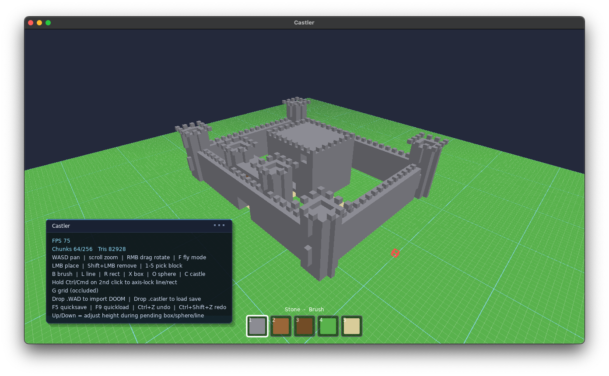

# Castler

A voxel castle builder in Love2D with structural physics, an RTS-style editor camera,
a free-fly first-person camera, and a built-in DOOM (`.WAD`) level importer that
voxelizes vanilla DOOM and DOOM II maps into the same world you build in.



The project follows the four-phase plan in [`spec.md`](spec.md) (data and rendering,
input and camera, structural integrity, UI) and the implementation outline in
[`prompt_plan.md`](prompt_plan.md), with additional quality-of-life features bolted on.

---

## Requirements

- [Love2D](https://love2d.org/) 11.x or newer. The renderer uses a custom GLSL
  shader, a 3D mesh with a depth buffer, and `love.mouse.setRelativeMode`,
  all of which require Love 11+.
- macOS, Linux, or Windows. No external Lua libraries; everything is vanilla
  Love2D plus the LuaJIT `bit` library.

## Running

From the repository root:

```
love .
```

On macOS without `love` on `$PATH`:

```
/Applications/love.app/Contents/MacOS/love /path/to/castler
```

The window opens at 1280x720 with depth buffer enabled (see `conf.lua`).

---

## Features

### World

- 128 x 64 x 128 voxel world (1,048,576 cells) backed by a flat 1D `data` array.
- Chunked rendering: 16-cell cubes, one Love2D `Mesh` per chunk. Edits dirty only
  the affected chunk plus any face-adjacent chunk across a seam, so rebuilds stay
  local. 256 chunks total; most stay empty (no mesh, zero draw call) until built into.
- Lighting baked into vertex colors at mesh-gen time (no per-pixel lighting
  pass): a fixed sun direction gives each face `ambient + diffuse * max(0,
  dot(normal, sun))`, multiplied by per-vertex ambient occlusion. AO darkens
  inner corners and crevices by sampling the three voxels around each face
  corner (classic Minecraft AO), with the quad diagonal flipped on
  anisotropic corners to avoid interpolation seams.
- Distance fog in the fragment shader fades distant geometry toward the scene
  background, giving DOOM-like depth.

### Camera modes

Two cameras share a common interface. Press **F** to toggle.

- **RTS** (default): spherical orbit around a target. WASD pans, scroll zooms,
  right-click drag rotates. All four animated values (target, yaw, pitch, distance)
  are exponentially smoothed for frame-rate-independent feel.
- **First-person**: mouse-look (cursor hidden via `setRelativeMode(true)`).
  Defaults to **walk**: gravity, AABB-vs-voxel collision with wall sliding,
  auto step-up over 1-voxel ledges, Space to jump, LShift to run. Press **N**
  to toggle **noclip** free-fly (WASD along the look direction, Space/Ctrl for
  up/down, LShift boost) for building and overview.

When toggling into first-person the camera syncs from the RTS view and settles
onto the ground beneath it. If a DOOM level was imported with a Player 1 start,
it spawns there with the correct facing instead.

### Build tools

Five tools, all use the same two-click anchor pattern except for Brush:

| Key | Tool   | Pattern                                                       |
| --- | ------ | ------------------------------------------------------------- |
| B   | Brush  | Single click places one block (or removes with Shift)         |
| L   | Line   | Click anchor, click endpoint - supercover line between them   |
| R   | Rect   | Click anchor on a face, click corner - fills axis-aligned rect on the plane derived from the face normal |
| X   | Box    | Click corner, click opposite corner - solid 3D cuboid         |
| O   | Sphere | Click center, click surface point - discrete ball (`dx2+dy2+dz2 <= r2`) |

Modifiers:

- **Hold Ctrl/Cmd on the second click** to axis-lock Line/Rect to a single
  dominant axis.
- **Up/Down arrows** (or PageUp/PageDown) during a pending Box/Sphere/Line op
  adjust the second click's Y offset. Needed because clicking a flat floor pins
  the second click's Y to the floor; the offset lets you build vertical extent.
- **Shift+LMB** removes instead of placing. Mode is sticky from the first click
  for two-click ops, so Shift slipping mid-operation doesn't mix modes.

Pending operation previews use a wireframe ghost. For large ops (over 500 cells)
the preview switches to "shell only" cells so the line-draw count stays cheap.
A neutral wireframe also outlines the exact solid block under the ray (what
right-click removes), distinct from the colored placement ghost.

### Minimap

Press **M** to toggle a top-down minimap (bottom-right). Each column is
colored by its topmost solid block, shaded lighter with height for relief.
Baked into an ImageData on a ~0.45s timer (cheap and self-correcting after
edits, castle regen, imports, or undo - no explicit invalidation hooks). A
yellow dot + line marks the camera's focus position and horizontal facing.

### Procedural castle generator

Press **C** to replace the current world with a procedural castle. The
generator builds a complete walled compound with:

- four round corner towers
- a front gatehouse with twin towers and a pass-through
- perimeter walls with crenellations
- a central keep (square hall or round donjon) with battlements
- courtyard paths stamped into the floor

The generator is browsable from the keyboard, with the current config shown in
the HUD panel:

| Key   | Action                                                |
| ----- | ----------------------------------------------------- |
| C     | Regenerate with a fresh random seed                   |
| [ / ] | Step the seed down / up (deterministic browsing)      |
| V     | Cycle size: Small / Medium / Large                    |
| K     | Cycle keep style: square hall / round donjon          |

`(seed, size, keep)` is fully deterministic: the size preset feeds explicit
dimensions while the seed drives the smaller per-castle variations, so the same
config always rebuilds the same castle.

`castle_generator.lua` owns the castle layout rules. `voxel_ops.lua` provides
the reusable stamping primitives, including boxes, hollow boxes, cylinders,
walls, floors, and crenellations. Generation marks all chunks dirty once and
flushes the renderer in one bulk pass. Undo history is cleared after generation,
matching the behavior of WAD imports and `.castler` loads.

### Structural integrity

When a block is removed, BFS flood-fills outward from each surviving solid
neighbor. Components that can't reach `y=1` (the ground) get zeroed out and
spawn falling particles colored from their palette entry. Single click in a
load-bearing column can cascade a whole tower. Implemented as BFS with a
pre-allocated `head`/`tail`-pointer queue and a shared `visited` set across all
six starting neighbors, so a connected component is walked once regardless of
how many of the removed block's neighbors are in it.

### Particles

3D-positioned fragments, drawn as 2D screen-space quads (project center to
screen, draw rect, fade in last 0.5s, size scales with `1/cw`). Integrated via
simple Euler with gravity = 22 u/s^2, lifetime 1.4 s.

### Grid

Press **G** to cycle off / overlay / occluded. Built once as a 3D mesh of thin
quads at `y = 1.01` (just above the floor), drawn through the voxel shader.
Minor lines every 1 cell, major (cyan) lines every 16 cells (chunk boundary).

- Overlay mode disables depth test - grid is always visible, including through walls.
- Occluded mode enables depth test with depth write off, so the grid is hidden
  behind voxels and the alpha doesn't pollute the depth buffer for things drawn
  after.

### Undo / redo

- **Ctrl+Z** or **Cmd+Z** undo
- **Ctrl+Shift+Z** or **Ctrl+Y** redo

Every `applyCells` becomes a single op recording `(x, y, z, oldId, newId)` per
cell. Stability cascades join the same op so one undo reverses both the click
and the dominoes that fell. Ring buffer cap: 30 ops. History clears on WAD
import and `.castler` load (world state changes too drastically).

### Save / load

- **F5** quicksave to `quicksave.castler` in Love2D's save directory.
- **F9** quickload from the same file.
- **Drag any `.castler` file** onto the window to load.

Format: 4-byte magic `CSLR`, u16 version, u16 W/H/D, palette dump (id + RGB per
entry), then RLE-encoded cell data (count u16, id u16 per run). Palette entries
above id 5 (sector-imported lit colors from DOOM imports) survive the round trip.

Save file locations:

- macOS: `~/Library/Application Support/LOVE/castler/quicksave.castler`
- Linux: `~/.local/share/love/castler/quicksave.castler`
- Windows: `%APPDATA%\LOVE\castler\quicksave.castler`

### DOOM map importer

Drag a vanilla DOOM `.WAD` (`DOOM.WAD`, `DOOM2.WAD`, etc.) onto the window.
The first level marker found (`E1M1`, `MAP01`, ...) is voxelized and replaces
the current world. The WAD bytes are retained so you can browse every level in
it with **,** (previous) and **.** (next) - no need to re-drop the file. The
HUD shows the current level name and index. Selection is cleared when a castle
is generated or a `.castler` save is loaded.

What is parsed:

- `VERTEXES`, `LINEDEFS`, `SIDEDEFS`, `SECTORS` for geometry.
- `THINGS` for the Player 1 start (type 1) - its position + facing become the
  Fly camera's spawn so pressing F drops you right where the DOOM player would
  start, facing the same way.

Per sector:

- Scanline polygon fill (even-odd rule, half-open Z to skip horizontal edges)
  stamps the floor terrain from `y = 1` up to `txY(floor)`.
- A one-block ceiling slab is placed at `txY(ceiling)`. Sectors with the
  `F_SKY1` ceiling texture stay open.
- Walls are emitted for single-sided linedefs (full height from floor+1 to
  ceiling) and for two-sided linedefs (the floor-height *difference* between
  the front and back sectors, as a "step" wall).
- Each sector gets two palette entries: a floor color and a 70%-darker ceiling
  color, both multiplied by `sector.light / 255` so the lit-room-at-the-end-of-
  the-hallway effect from DOOM is preserved.

Scaling:

```
scaleXZ = max( mapW / usableW,  mapD / usableD )    aspect preserved
scaleY  = scaleXZ                                    a voxel cube == same DOOM units on every axis
        (falls back to fit-to-world.height for tall maps)
```

For DOOM2 MAP01 (around 3600 x 4000 DOOM units) into a 120 x 120 cell usable
area, `scaleXZ` is about 33 DOOM units per voxel. Anything thinner than one
voxel does not survive rasterization, which is why fine-grained detail (small
corridors, low steps) compresses away.

Mirror fix: DOOM's `+Y` is north; we use `txZ(t, y) = (maxY - y) / scale + margin`
so the imported map reads the same way as the DOOM editor's wireframe view
(north toward low world Z, near the camera by default).

---

## Controls reference

### RTS mode (default)

| Input            | Action                                          |
| ---------------- | ----------------------------------------------- |
| WASD             | Pan target along ground plane                   |
| Scroll wheel     | Zoom (distance from target, 6..400)             |
| Alt + left-drag  | Orbit (yaw free, pitch 10..85 degrees)          |
| Left-click       | Place / commit pending op                       |
| Right-click      | Remove the targeted block (floor y=1 protected) |
| Shift+Left-click | Remove (tool-shaped; floor y=1 protected)       |
| Middle-click     | Eyedropper - pick block under cursor            |
| 1..5             | Pick block (Stone, Wood, Dirt, Grass, Sand)     |
| B / L / R / X / O| Brush / Line / Rect / Box / Sphere              |
| E                | Toggle Add / Subtract mode (all tools)          |
| T                | Toggle building on/off (cursor + clicks)        |
| C                | Generate procedural castle                      |
| Up / Down arrows | Adjust pending op height offset                 |
| Ctrl / Cmd       | Axis-lock during pending Line/Rect second click |
| G                | Grid: off / overlay / occluded                  |
| J                | Cycle sun position (re-bakes lighting)          |
| M                | Toggle minimap                                  |
| , / .            | Previous / next level in the dropped WAD        |
| F                | Enter first-person (walk)                       |
| F5 / F9          | Quicksave / quickload                           |
| Ctrl+Z / Y / Shift+Z | Undo / redo                                 |
| Esc              | Cancel pending op (first press) / quit (second) |

### First-person mode

Defaults to **walk**. Press **N** to toggle noclip.

| Input            | Walk                          | Noclip                        |
| ---------------- | ----------------------------- | ----------------------------- |
| Mouse motion     | Look (pitch clamped +-89)     | Look (pitch clamped +-89)     |
| WASD             | Move (horizontal)             | Fly along look direction      |
| Space            | Jump                          | Up (world +Y)                 |
| Ctrl             | -                             | Down (world -Y)               |
| LShift           | Run (1.9x)                    | Boost (2.8x)                  |
| Left-click       | Place / commit (screen-center ray) | same                     |
| Right-click      | Remove targeted block         | Remove targeted block         |
| Middle-click     | Eyedropper                    | Eyedropper                    |
| N                | Switch to noclip              | Switch to walk                |
| F                | Return to RTS                 | Return to RTS                 |

---

## Architecture

```
main.lua              Wires all systems together. Owns the active camera,
                     mode toggling, file-dropped dispatch, and key handling.

voxel_world.lua       Flat 1D block grid (cells indexed x-fastest, y, z).
                     Palette (id -> RGB), getBlock/setBlock/inBounds,
                     bulk clear, forEachSolid iterator.

chunk_manager.lua     16-cube chunks, one Mesh per chunk. markDirty for cell
                     edits, flushDirty rebuilds flagged chunks. Sends MVP and
                     fog uniforms to the voxel shader; draws chunks with
                     depth-test enabled.

matrix.lua            4x4 column-major math: perspective, lookAt, multiply,
                     inverse, mat4 * vec4 helpers.

rts_camera.lua        Spherical orbit camera. Exponential smoothing on target,
                     yaw, pitch, and distance.

fly_camera.lua        First-person free-fly. Sync from RTS so toggling is
                     continuous; relative-mouse mode while active.

build_manager.lua     Mouse-driven build/destroy. Unproject cursor to a ray,
                     Amanatides-and-Woo DDA traversal of the voxel grid,
                     wireframe ghost preview, brush/line/rect/box/sphere tools,
                     two-click anchor pattern, axis-lock and height-offset
                     modifiers. Calls into stability + particles + undo on
                     each commit.

structural_integrity.lua  BFS stability check. Pre-allocated flat-table queue,
                         shared visited set across the six starting neighbors,
                         returns flat list of (x, y, z, id) for collapsed cells.

particles.lua         3D-positioned fragments, projected to screen each frame
                     as 2D quads; gravity-integrated; alpha fades in the last
                     0.5s of lifetime.

grid.lua              Three-state reference grid (off / overlay / occluded)
                     built as a 3D thin-quad mesh, drawn through the voxel
                     shader with fog disabled.

undo_manager.lua      Per-operation undo/redo. Each op records (x, y, z,
                     oldId, newId) per changed cell. Stability cascades and
                     bulk ops join the triggering op. 30-op ring buffer.

world_io.lua          Save/load. Binary format with magic, dimensions,
                     palette dump, and RLE-encoded cell data.

wad_loader.lua        Minimal vanilla DOOM WAD parser. Reads header, lump
                     directory, and the lumps needed for voxelization
                     (VERTEXES, LINEDEFS, SIDEDEFS, SECTORS, THINGS).

doom_voxelizer.lua    Converts a parsed level into voxel placements. Computes
                     scale + offset, builds per-sector lit palette entries,
                     scanline-fills sector polygons, stamps single-sided and
                     two-sided step walls, places Player 1 start.

voxel_ops.lua         Reusable voxel stamping primitives for generated
                     structures: filled and hollow boxes, cylinders, walls,
                     floors, and crenellations.

castle_generator.lua  Seeded procedural castle generator. Composes voxel_ops
                     primitives into walls, towers, a gatehouse, a central
                     keep, battlements, and courtyard paths.

ui.lua                2D HUD overlay - hotbar, status line, control hints,
                     transient import banner. Drawn with depth disabled.

minimap.lua           Top-down minimap. Bakes topmost-solid-per-column into an
                     ImageData on a throttled timer; overlays a camera marker.

main.lua              See above. Imports the rest, wires Love2D callbacks.

shaders/voxel.glsl    Voxel shader. MVP vertex transform, view-space depth
                     varying, fragment shader blends color toward fog color
                     over distance. Same shader used by chunk meshes and the
                     grid (grid sends u_fogEnabled = 0).

conf.lua              Love2D config: 1280x720 window, depth buffer 24-bit,
                     msaa 0, vsync on.
```

---

## License

The Lua source is original. WAD parsing follows the public DOOM Wiki spec
(<https://doomwiki.org/wiki/WAD>). DOOM and DOOM II are trademarks of id
Software; this project doesn't ship any of their data. Bring your own WAD.
